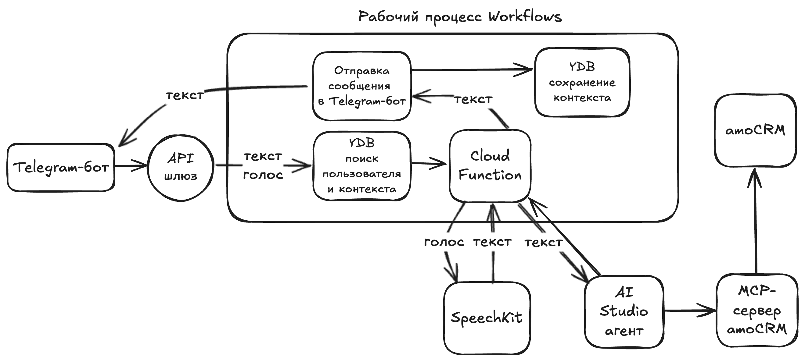

# CRM AI Agent Cookbook

<p align="center">
  <strong>Пошаговый cookbook по созданию Telegram-ассистента для CRM-сценариев на базе Yandex Cloud, AI Studio, amoCRM MCP, Workflows, SpeechKit, Cloud Functions, API Gateway и YDB.</strong>
</p>

<p align="center">
  <a href="./crm_ai_agent_cookbook.ipynb"></a>
  
  
  
  
</p>

---

## Обзор

Этот репозиторий содержит пошаговый notebook-cookbook по развертыванию **AI-ассистента для CRM-операций** на примере **amoCRM**.

Ассистент позволяет менеджерам по продажам работать с CRM-данными прямо из **Telegram-бота** с помощью текстовых или голосовых сообщений. Он умеет искать клиентов, сделки, контакты, компании, задачи, примечания и воронки, а также создавать или обновлять CRM-записи через AI-driven workflow.

> Основной cookbook находится в notebook-файле: [`crm_ai_agent_cookbook.ipynb`](./crm_ai_agent_cookbook.ipynb).

---

## Что вы соберете

Следуя notebook, вы развернете serverless CRM-ассистента, который умеет:

- 💬 принимать текстовые сообщения из Telegram;
- 🎙️ распознавать голосовые сообщения с помощью Yandex SpeechKit;
- 🤖 отправлять пользовательские запросы AI Studio агенту через Responses API;
- 🔌 подключать агента к amoCRM через MCP-сервер;
- 🔐 авторизовывать пользователей Telegram через документную таблицу YDB;
- 🧩 оркестрировать жизненный цикл запроса с помощью Yandex Workflows;
- 🌐 принимать Telegram webhook через API Gateway;
- 🧹 удалять созданные облачные ресурсы после завершения работы.

---

## Архитектура



Решение использует следующие сервисы и компоненты Yandex Cloud:

| Слой | Компонент | Назначение |
|---|---|---|
| Пользовательский интерфейс | Telegram Bot | Принимает текстовые и голосовые запросы пользователей |
| Точка входа | API Gateway | Принимает события Telegram webhook |
| Оркестрация | Workflows | Проверяет пользователей, вызывает функции, ожидает AI-ответы, отправляет ответы |
| AI-слой | AI Studio Agent | Интерпретирует CRM-запросы и определяет, что нужно сделать |
| Интеграция с CRM | amoCRM MCP Server | Дает AI-агенту доступ к выбранным инструментам amoCRM |
| Обработка голоса | SpeechKit | Преобразует голосовые сообщения Telegram в текст |
| Вычисления | Cloud Functions | Выполняет подготовку запросов и получение ответов |
| Хранение данных | Managed Service for YDB | Хранит разрешенные Telegram chat ID и AI response ID |
| Секреты | Lockbox | Хранит токены Telegram и amoCRM |

---

## Структура репозитория

```text
.
├── crm_ai_agent_cookbook.ipynb   # Основной пошаговый notebook-cookbook
├── assets/
│   └── architecture.png          # Диаграмма архитектуры решения
└── README.md                     # Обзор репозитория и инструкция по использованию
```

---

## Предварительные требования

Перед началом убедитесь, что у вас есть:

- активный или пробный платежный аккаунт Yandex Cloud;
- права `admin` в целевом каталоге Yandex Cloud;
- аккаунт amoCRM и долгоживущий токен amoCRM;
- Telegram-бот, созданный через [BotFather](https://t.me/BotFather);
- доступ к Yandex AI Studio, Workflows, Cloud Functions, API Gateway, Lockbox, SpeechKit и Managed Service for YDB.

В notebook создаются и используются следующие сервисные аккаунты:

| Сервисный аккаунт | Используется для | Необходимые роли |
|---|---|---|
| `sa-apigw` | API Gateway | `serverless.workflows.executor` |
| `sa-workflows` | Workflows | `lockbox.payloadViewer`, `functions.functionInvoker`, `ydb.editor` |
| `sa-ai-agent` | Cloud Functions | `ai.assistants.viewer`, `ai.languageModels.user`, `ai.speechkit-stt.user`, `lockbox.payloadViewer`, `serverless.mcpGateways.invoker`, `functions.viewer` |
| `sa-mcp-server` | MCP server | `lockbox.payloadViewer` |

---

## Быстрый старт

### 1. Склонируйте репозиторий

```bash
git clone <your-repository-url>
cd <your-repository-name>
```

### 2. Откройте cookbook

Откройте notebook в Jupyter, VS Code или другой среде, совместимой с notebook-файлами:

```bash
jupyter notebook crm_ai_agent_cookbook.ipynb
```

Также notebook можно просматривать прямо на GitHub.

### 3. Подготовьте облачные ресурсы

Следуйте разделам notebook, чтобы:

1. создать сервисные аккаунты и назначить роли;
2. создать секреты Telegram и amoCRM в Lockbox;
3. создать serverless-базу YDB с именем `crm-bot-db`;
4. создать документную таблицу `chat-bot-users`;
5. добавить разрешенные Telegram `chat_id` в таблицу.

### 4. Настройте CRM AI-агента

В Yandex AI Studio:

1. создайте MCP-сервер из шаблона **amoCRM**;
2. подключите необходимые инструменты amoCRM;
3. создайте AI-агента с именем `crm-ai-agent`;
4. добавьте инструкции для агента из notebook;
5. подключите к агенту приватный amoCRM MCP-сервер.

### 5. Разверните Cloud Functions

В notebook описаны две Python-функции:

| Функция | Назначение |
|---|---|
| `crm-ai-agent-request` | Обрабатывает сообщения Telegram, распознает голосовой ввод и запускает ответ AI-агента |
| `crm-ai-agent-result` | Получает финальный ответ AI-агента по `response_id` |

Обе функции используют Python-зависимости, например:

```text
openai==2.9.0
pyTelegramBotAPI==4.27
```

### 6. Создайте workflow

Создайте Yandex Workflows workflow с именем `crm-bot-workflows`, используя YaWL-спецификацию из notebook.

Workflow:

1. проверяет, авторизован ли пользователь Telegram в YDB;
2. отправляет запрос в функцию AI-агента;
3. опрашивает статус AI-ответа;
4. возвращает финальный ответ в Telegram;
5. запрещает доступ неизвестным пользователям.

### 7. Создайте API Gateway

Создайте API Gateway с именем `crm-bot-api-gw` и вставьте OpenAPI-спецификацию из notebook.

После развертывания сохраните служебный домен gateway и настройте Telegram webhook:

```python
BOT_TOKEN = "<telegram_bot_token>"
API_GW_DOMAIN = "<api_gateway_service_domain>"
```

Webhook URL должен указывать на:

```text
<API_GW_DOMAIN>/handle
```

---

## Тестирование

После развертывания:

1. Откройте Telegram-бота.
2. Отправьте:

   ```text
   Расскажи, что ты умеешь делать
   ```

3. Попробуйте CRM-запрос:

   ```text
   Выведи информацию о сделках компании <название_компании>
   ```

4. Проверьте голосовое сообщение.
5. Используйте `/clear` из меню бота, чтобы сбросить контекст диалога.

Ожидаемый ответ при сбросе контекста:

```text
Контекст предыдущего общения очищен. Начнем с чистого листа.
```

---

## Безопасность

- Не коммитьте реальные токены Telegram или amoCRM в репозиторий.
- Храните все секреты в Yandex Lockbox.
- Добавляйте в таблицу авторизации YDB только доверенные Telegram `chat_id`.
- Оставляйте MCP-сервер приватным.
- Назначайте каждому сервисному аккаунту минимально необходимые роли.
- Удаляйте демо-ресурсы после тестирования, чтобы избежать лишних расходов.

---

## Очистка ресурсов

Чтобы прекратить оплату созданных ресурсов, удалите:

- API Gateway `crm-bot-api-gw`;
- Workflow `crm-bot-workflows`;
- Cloud Functions `crm-ai-agent-request` и `crm-ai-agent-result`;
- AI-агента `crm-ai-agent`;
- MCP-сервер `amocrm-mcp-server`;
- базу YDB `crm-bot-db`;
- Lockbox-секреты для токенов Telegram и amoCRM;
- log groups, если вы включали пользовательское логирование.

---

## Устранение неполадок

| Проблема | Что проверить |
|---|---|
| Telegram-бот не отвечает | Webhook URL, домен API Gateway, логи выполнения workflow |
| Пользователь получает отказ в доступе | `chat_id` есть в таблице YDB `chat-bot-users` |
| Не работают голосовые сообщения | Роль SpeechKit у `sa-ai-agent`, обработку audio payload, логи функции |
| AI-ответ пустой или зависает | Статус Responses API, polling loop в workflow, хранение `response_id` |
| Действия amoCRM не выполняются | Конфигурацию MCP-сервера, токен amoCRM, выбранные MCP-инструменты |
| Функция не может получить секреты | Роль `lockbox.payloadViewer` и корректные ID секретов Lockbox |

---

## Идеи для развития

Возможные улучшения cookbook:

- добавить Terraform или CLI-автоматизацию для создания ресурсов;
- добавить скриншоты для каждого шага в облачной консоли;
- добавить минимальный демо-набор данных для amoCRM;
- добавить структурированное логирование и monitoring dashboards;
- добавить CI-проверки валидности notebook;
- при необходимости хранить отдельные README-файлы на русском и английском языках.

---

## Лицензия

Добавьте предпочитаемую лицензию перед публикацией репозитория.
